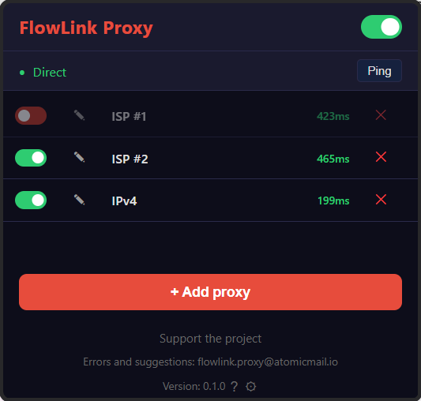
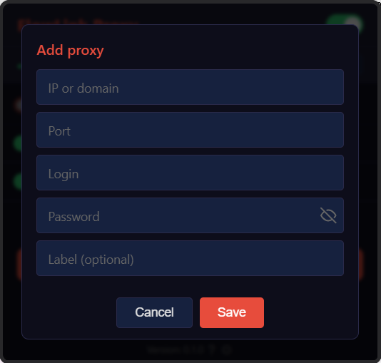
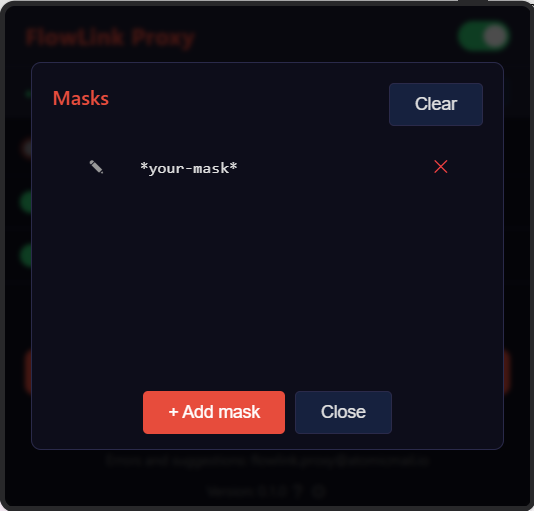
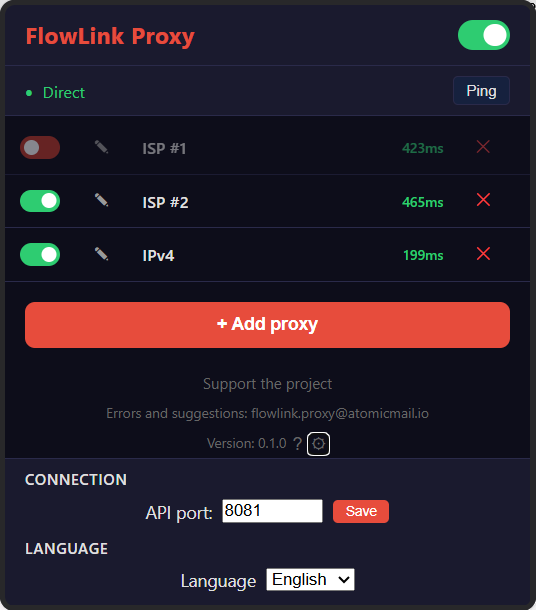
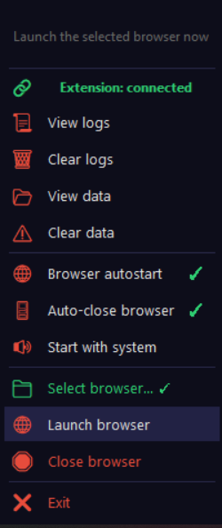

# FlowLink Proxy

[](https://www.python.org/)
[](extension/)
[](LICENSE.txt)
[](https://github.com/FlowHack/flowlink-proxy/actions/workflows/ci.yml)
[](https://github.com/FlowHack/flowlink-proxy/releases/latest)

[](https://aiderdesk.com)
[](https://deepseek.com)
[](https://mistral.ai)
[](https://gemini.google.com)
[](https://github.com/FlowHack/flowlink-proxy)

Автоматическая маршрутизация трафика: сайты по маскам — через SOCKS5-прокси с паролем, остальные — напрямую.

> Chrome не умеет передавать логин/пароль в SOCKS5. FlowLink Proxy берёт аутентификацию на себя, а браузер работает через обычный HTTP-прокси `localhost:8080`.

```
Браузер → HTTP CONNECT localhost:8080 (без пароля)
                │
        Python-бэкенд (server/)
                │
     ┌──────────┴──────────┐
     ▼                      ▼
Маска совпала?         Маска не совпала?
     │                      │
     ▼                      ▼
SOCKS5 с паролем       Прямое соединение
(ваш сервер)           ( Happ / интернет )
```

---

## Содержание

[Создание проекта](#создание-проекта) · [Технологический стек](#технологический-стек) · [Быстрый старт](#быстрый-старт) · [Интерфейс расширения](#интерфейс-расширения) · [Системный трей](#системный-трей) · [Устранение проблем](#устранение-проблем) · [Структура проекта](#структура-проекта) · [Документация](#документация) · [Требования](#требования) · [Удаление](#удаление) · [FAQ](#faq-часто-задаваемые-вопросы) · [Лицензия](#лицензия) · [Контакты](#контакты)

---

## Создание проекта

FlowLink Proxy создан с использованием **AI-assisted development** в среде **AiderDesk**.

**Роли:**
- **DeepSeek (Architect Manager)** — архитектура проекта, распределение задач, контроль качества, выполнение сверхсложных задач (ядро, TLS, криптография, asyncio-сокеты)
- **Big Pickle (SubAgent)** — чтение файлов, реализация задач средней сложности, рефакторинг, написание тестов, QA (pylint, pyright, pytest), ревью кода
- **Mistral (SubAgent)** — первичный генератор кода: новые функции, модули, рефакторинг, исправление багов
- **Gemini (SubAgent)** — резервный генератор кода (используется, когда Mistral недоступен)

Архитектор-менеджер определяет план, делегирует выполнение субагентам и проверяет результат. Такой подход позволил поддерживать высокое качество кода при минимальном времени разработки.

---

## Технологический стек

| Категория | Технологии |
|---|---|
| **Языки** | Python 3.10+, JavaScript (ES Modules), Shell, PowerShell |
| **Бэкенд** | asyncio, HTTP CONNECT-прокси, SOCKS5-клиент (чистый struct/asyncio), SSE-шина событий |
| **Шифрование** | AES-256-GCM + PBKDF2-HMAC-SHA256 (cryptography) |
| **Системный трей** | tkinter (кастомное тёмное меню), pystray, Win32 ctypes |
| **Расширение** | Chrome Extension Manifest V3, Service Worker, EventSource (SSE) |
| **Сборка** | PyInstaller (standalone), Inno Setup (Windows), dpkg-deb / rpmbuild (Linux), pkgbuild (macOS), CRX/ZIP (расширение) |
| **CI/CD** | GitHub Actions (lint + typecheck + pytest; multios сборка + релизы по тегам) |
| **Качество** | pytest, pylint >= 9.0, pyright (type-checking) |
| **Платформы** | Windows 10+, Linux x64, macOS (Intel + Apple Silicon) |

Ключевые особенности:
- **Плагинная архитектура протоколов** — `ProxyProtocol` ABC + фабрика; добавление нового протокола = новый класс + регистрация
- **Mask Router** — wildcard-маски конвертируются в precompiled regex, кешируются, O(n) по активным правилам
- **SSRF-защита** — резолв IP, блокировка private/loopback/link-local диапазонов
- **Пароли в AES-256-GCM** — authenticated encryption, PBKDF2 (600k итераций)
- **Состояние в памяти** — `isEnabled` не пишется на диск; SSE push при реконнекте расширения
- **Multi-platform tray** — цепочка fallback'ов (Win32 → pystray+tkinter)
- **Connection teardown** — при изменении конфига активные туннели принудительно закрываются
- **Dev mode** — hot-reload, mock SOCKS5-сервер, генерация тестовых данных

---

## Быстрый старт

### 1. Скачайте и запустите бэкенд

Перейдите на [страницу релизов](https://github.com/FlowHack/flowlink-proxy/releases/latest) и скачайте архив для вашей ОС:

| Платформа | Файл | Установка |
|-----------|------|-----------|
| **Windows x64** | `FlowLink-Proxy-v*-Setup.exe` | Запустите установщик → следуйте инструкциям |

> **Внимание:** при первом запуске установщика Windows SmartScreen может показать предупреждение «Windows защитил ваш компьютер». Нажмите **«Подробнее»** → **«Выполнить в любом случае»**. Это стандартное поведение для новых программ без платной цифровой подписи — предупреждение исчезнет после набора репутации.
| **Linux x64** | `FlowLink-Proxy-v*-linux-x64.tar.gz` | Распакуйте → запустите лаунчер `FlowLink Proxy-linux.sh` (или бинарник `FlowLink Proxy`) |
| **Linux x64** | `FlowLink-Proxy_<версия>_amd64.deb` | `sudo dpkg -i FlowLink-Proxy_*.deb` |
| **Linux x64** | `FlowLink-Proxy-<версия>-1.x86_64.rpm` | `sudo rpm -i FlowLink-Proxy-*.rpm` |
| **macOS Intel** | `FlowLink-Proxy-v*-macos-x64.tar.gz` | Распакуйте → запустите |
| **macOS Apple Silicon** | `FlowLink-Proxy-v*-macos-arm64.tar.gz` | Распакуйте → запустите |
| **macOS** | `FlowLink-Proxy-<версия>-macos-<арх>.pkg` | Дважды кликните по `.pkg` |
| **Все платформы** | `FlowLink-Proxy-v*-extension.zip` / `.crx` | Расширение Chrome: распакуйте ZIP и загрузите как распакованное (или установите `.crx`) |

> Подробные инструкции по каждому способу: **[SETUP.md](SETUP.md)**
>
> Используя FlowLink Proxy, вы соглашаетесь с условиями **[Лицензионного соглашения (EULA)](EULA.rtf)**. Обработка данных описана в **[Политике конфиденциальности](PRIVACY_POLICY.md)**.

### 2. Установите расширение

Расширение можно установить двумя способами: из архива релиза (`FlowLink-Proxy-v*-extension.zip` или `.crx` — см. вложения релиза) или из исходников. В обоих случаях:

1. Откройте страницу расширений в браузере (см. таблицу ниже).
2. Включите «Режим разработчика».
3. **Из ZIP:** распакуйте архив → «Загрузить распакованное расширение» → выберите распакованную папку. **Из исходников:** «Загрузить распакованное расширение» → выберите папку `extension/`. **Из `.crx`:** перетащите файл `.crx` на страницу расширений.

| Браузер | Страница расширений |
|---------|---------------------|
| Chrome | `chrome://extensions` |
| Yandex Browser | `browser://extensions` |
| Opera | `opera://extensions` |
| Edge | `edge://extensions` |

> Расширение настраивает браузер автоматически (флаг `--proxy-server`).

### 3. Готово

Нажмите иконку FlowLink Proxy в панели расширений → добавьте прокси и маски.

---

## Интерфейс расширения

Нажмите иконку FlowLink Proxy в панели расширений.



#### Добавление прокси

1. Нажмите **«Добавить прокси»**
2. Заполните поля:
   - **IP** — адрес SOCKS5-сервера (например `80.243.18.120`)
   - **Порт** — порт SOCKS5-сервера (например `10000`)
   - **Логин** — имя пользователя
   - **Пароль** — пароль (хранится в зашифрованном виде)
   - **Метка** — удобное название (например «Мой прокси»)
3. Нажмите **«Сохранить»**



#### Добавление маски

Маска определяет, какие сайты идут через прокси, а какие — напрямую.

1. Нажмите на **иконку масок** (ряду с нужным прокси) — откроется список масок для этого прокси
2. Нажмите **«Добавить маску»**
3. Введите шаблон. Примеры:
   - `*google.com*` — все домены google.com
   - `*translate.google.com*` — только Google Translate
   - `*github.com*` — все домены github.com
4. Нажмите **«Сохранить»**


> Маска привязывается к тому прокси, рядом с которым вы открыли список. Символ `*` заменяет любую часть адреса. Маски автоматически конвертируются в регулярные выражения.



#### Конфликты масок

Маски разных прокси могут пересекаться, включать друг друга или быть идентичными — это допустимо. Однако **в группе прокси с пересекающимися масками может быть включён только один прокси**. Если вы попытаетесь включить прокси, чьи маски пересекаются с масками уже включённого прокси, — включение будет отклонено с понятным сообщением. Выключите конфликтующий прокси или измените маски.

При перезапуске FlowLink Proxy восстанавливается последний включённый прокси. Если все прокси были выключены — они останутся выключенными.

#### Включение и выключение

- **Глобальный тоггл** (внизу окна) — включает/выключает весь FlowLink Proxy. При выключении весь трафик идёт напрямую (минуя прокси).
- **Тоггл прокси** (ряду с каждым прокси) — включает/выключает отдельный прокси. Маски, привязанные к выключенному прокси, игнорируются.

#### Пинг

Нажмите **«Пинг»** чтобы проверить доступность всех прокси. Результат показывает время отклика (в мс) или «н/д» если прокси недоступен.

#### Настройки (⚙)

Нажмите шестерёнку рядом с версией:
- **Порт API** — измените если бэкенд работает на другом порту (по умолчанию `8081`)
- **Обновление** — проверить наличие новой версии



#### Директория данных

Все данные FlowLink Proxy хранятся в стандартной директории данных ОС:

| ОС | Путь |
|---|---|
| Linux / macOS | `~/.FlowHack/FlowLink Proxy/` |
| Windows | `%APPDATA%\FlowHack\FlowLink Proxy\` |
| systemd | Путь из `FLOWLINK_DATA_DIR` |

Содержимое: `config.json`, ключи шифрования (`.flowlink.key`, `.flowlink.salt`), настройки автозапуска браузера, пути к браузеру, флага загрузки расширения (`.flowlink-settings`), порты (`.flowlink-port`), логи (`logs/`).

Очистить все данные можно через иконку в системном трее → «Очистить все данные».

---

## Системный трей

После запуска бэкенда в системном трее (рядом с часами) появляется иконка FlowLink Proxy. 
Правый клик открывает контекстное меню со следующими пунктами:



| Пункт меню | Описание |
|---|---|
| 📜 Посмотреть логи | Открывает папку с логами в файловом менеджере |
| 🗑 Очистить логи | Удаляет все файлы логов |
| 📂 Посмотреть данные | Открывает папку с данными (конфиги, ключи, настройки) |
| ⚠️ Очистить данные | Удаляет все конфиги, ключи и настройки (сброс к заводским) |
| 🌐 Автозапуск браузера | Чекбокс: при запуске бэкенда автоматически запускать браузер |
| 🔊 Запуск с системой | Чекбокс: автоматически запускать бэкенд при входе в систему |
| 📁 Выбрать браузер... | Открывает диалог выбора браузера (автопоиск + ручной выбор). Выбранный браузер подсвечивается зелёной галочкой |
| 🌐 Запустить браузер | Немедленно запустить браузер с настроенным прокси |
| ❌ Выход | Остановить бэкенд и закрыть приложение |

**Выбор браузера:** при нажатии «Выбрать браузер...» выполняется автоматический поиск 
установленных браузеров. Найденные браузеры отображаются в виде списка — достаточно 
кликнуть по нужному, чтобы сохранить путь. Выбранный браузер подсвечивается зелёной 
галочкой; вручную указанный ненайденный браузер отображается в списке как обычный элемент. 
Если браузер не найден, можно указать путь вручную через системный диалог выбора файла.

**Запуск браузера:** пункт «Запустить браузер» запускает выбранный браузер с флагом `--proxy-server`, 
направляющим трафик через локальный прокси FlowLink Proxy. Браузер запускается с обычным профилем 
пользователя — все закладки, пароли и расширения остаются доступными.

**Отказоустойчивость меню:** если меню трея не удалось создать (например, произошла ошибка 
рендера), бэкенд не падает — ошибка перехватывается и записывается в лог. Для работы трея 
и диалогов бэкенда обязателен **tkinter** (Linux: `sudo apt install python3-tk`). Если tkinter 
недоступен, трей не запускается, а диалоги (выбор браузера, предупреждения) не отображаются.

---

## Устранение проблем

| Симптом | Решение |
|---------|---------|
| «Нет связи с бэкендом» | Бэкенд не запущен. Запустите бинарник или `python -m server` |
| `ERR_PROXY_CONNECTION_FAILED` | Браузер на SOCKS5 вместо HTTP. Флаг: `--proxy-server=127.0.0.1:8080` |
| Порт 8080 занят | Завершите старый процесс: Linux `lsof -i :8080`, Windows — Диспетчер задач |

Подробная таблица проблем: **[SETUP.md](SETUP.md#устранение-проблем-при-установке)**. Отладка: **[DEBUG.md](DEBUG.md)**

---

## Структура проекта

```
flowlink-proxy/
├── server/                    # Python-бэкенд
│   ├── __main__.py            # Точка входа (CLI + tray icon)
│   ├── version.py             # Версия проекта
│   ├── logging_config.py      # Настройка логгера (файл + консоль)
│   ├── tray/                  # System tray icon (tkinter / pystray / ctypes)
│   │   ├── __init__.py        # Координатор: start_tray()
│   │   ├── platform.py        # Определение ОС и возможностей
│   │   ├── popup.py           # Tkinter безрамочное меню (тёмная тема)
│   │   ├── menu.py            # Общая логика построения меню
│   │   ├── pystray_base.py    # Базовый класс pystray-трея
│   │   ├── win32.py           # Win32 Tray (ctypes)
│   │   ├── linux.py           # Linux Tray (pystray + tkinter)
│   │   └── macos.py           # macOS Tray (pystray + tkinter)
│   ├── config/
│   │   ├── config.py          # Бизнес-логика конфига (proxies, masks, enabled)
│   │   ├── repo.py            # Чтение/запись config.json
│   │   ├── crypto.py          # AES-GCM шифрование паролей (PBKDF2)
│   │   ├── autostart.py       # Настройки автозапуска браузера
│   │   ├── browser_config.py  # Конфигурация браузера (автопоиск, валидация, запуск)
│   │   ├── browser_process.py # Управление процессами браузера (поиск PID, kill)
│   │   └── system_autostart.py # Автозапуск с системой (Win/Linux/macOS)
│   ├── protocols/
│   │   ├── base.py            # ABC ProxyProtocol
│   │   ├── socks5.py          # SOCKS5-клиент (чистый asyncio + struct)
│   │   ├── factory.py         # Фабрика протоколов
│   │   ├── parser.py          # Парсинг CONNECT/HTTP-запросов
│   │   ├── mock_socks5.py     # Тестовый SOCKS5-сервер (--dev)
│   │   └── socks5_constants.py # Константы SOCKS5-протокола
│   ├── services/
│   │   ├── router.py          # Маршрутизация URL по маскам
│   │   ├── tunnel.py          # Установка туннелей (SOCKS5 / прямой) + SSRF-защита
│   │   ├── pipe.py            # Двусторонняя пересылка данных
│   │   ├── ping.py            # Пинг прокси (SOCKS5 handshake)
│   │   ├── debug.py           # Debug-утилиты
│   │   ├── events.py          # SSE-шина событий
│   │   ├── sse.py             # SSE-обработчик (text/event-stream)
│   │   ├── extension_connection.py # Отслеживание подключения расширения
│   │   ├── fake_proxies.py    # Генерация тестовых прокси (--count-proxy)
│   │   └── mask_conflicts.py  # Проверка конфликтов масок (пересечение паттернов)
│   ├── servers/
│   │   ├── base_server.py     # ABC BaseServer
│   │   ├── proxy.py           # HTTP CONNECT прокси (порт 8080)
│   │   ├── api.py             # HTTP API (порт 8081)
│   │   └── handlers.py        # Обработчики API-эндпоинтов
│   ├── ui/
│   │   ├── dialogs.py         # Кастомные tkinter-диалоги (show_info, show_item_picker)
│   │   └── theme.py           # Тёмная тема для диалогов
│   ├── utils.py               # Утилиты (get_data_dir, clear_all_data, write_port_file)
│   ├── icons/                 # Иконки бэкенда (icon.ico, icon.png)
│   ├── requirements.txt       # Зависимости Python
│   └── tests/                 # Юнит-тесты
│       ├── base.py            # Базовые миксины (TempConfigMixin)
│       ├── conftest.py        # Общие вспомогательные функции
│       ├── test_config.py
│       ├── test_crypto.py
│       ├── test_handlers.py
│       ├── test_events.py
│       ├── test_proxy_server.py
│       ├── test_router.py
│       ├── test_socks5.py
│       ├── test_tunnel.py     # SSRF-защита validate_target()
│       ├── test_utils.py
│       ├── test_autostart.py
│       ├── test_browser_config.py
│       ├── test_fake_proxies.py
│       ├── test_system_autostart.py
│       ├── test_tray_menu.py
│       ├── test_tray_platform.py
│       ├── test_tray_popup.py
│       ├── test_tray_fallback.py
│       ├── test_main_launch_browser.py
│       ├── test_main_autostart.py
│       ├── test_main_close_browser.py
│       ├── test_extension_timeout.py
│       ├── test_extension_connection.py
│       ├── test_dialogs.py
│       ├── test_build_scripts.py
│       ├── test_browser_process.py
│       └── test_api_routes.py
│
├── extension/                 # Chrome-расширение (Manifest V3)
│   ├── manifest.json          # Манифест расширения
│   ├── _locales/              # Локализация расширения (ru/en/sr)
│   ├── background/
│   │   └── service-worker.js  # SSE-клиент + pushEnabledState
│   ├── popup/
│   │   ├── popup.html         # Главное окно
│   │   ├── popup.css          # Стили
│   │   ├── popup.js           # Главный контроллер
│   │   ├── crud-proxy.js      # CRUD-операции с прокси
│   │   ├── crud-mask.js       # CRUD-операции с масками
│   │   ├── draft.js           # Черновики форм (chrome.storage.session)
│   │   ├── ping.js            # Пинг прокси
│   │   ├── settings.js        # Настройки порта API
│   │   ├── tab-status.js      # Статус текущей вкладки
│   │   ├── modal.js           # Модальные окна
│   │   ├── help.js            # Окно помощи
│   │   ├── help-page.js       # Логика статической справки (help.html)
│   │   ├── help.css           # Стили справки
│   │   ├── help.html          # Статическая справка (открывается из tkinter-диалога)
│   │   └── updater.js         # Проверка обновлений
│   ├── shared/
│   │   ├── api.js             # HTTP хелперы (apiGet, apiPost, apiPatch, apiDelete, apiPostRaw)
│   │   ├── auth.js            # Работа с токеном авторизации API
│   │   ├── constants.js       # API_BASE, GitHub URLs
│   │   ├── dom.js             # escapeHtml, утилиты DOM
│   │   ├── i18n.js            # Словарь переводов (RU/EN/SR)
│   │   ├── utils.js           # Валидация IP/port, wildcard→regex, copyEmailToClipboard
│   │   └── port_discovery.js  # Автообнаружение порта API
│   ├── tests/                 # Тесты расширения
│   │   ├── auth.test.js       # Тесты токена авторизации
│   │   ├── draft.test.js      # Тесты черновиков форм
│   │   ├── help.test.js       # Тесты логики вкладок справки
│   │   └── port.test.js       # Тесты автообнаружения порта
│   └── icons/                 # Иконки расширения
│
├── scripts/
│   ├── installer/
│   │   └── flowlink-installer.iss  # Inno Setup установщик Windows
│   ├── icons/
│   │   ├── icon.ico            # Иконка для установщика и ярлыков
│   │   ├── icon.png            # Иконка для Linux/macOS
│   │   └── icon.icns           # Иконка для macOS
│   ├── launcher/
│   │   ├── FlowLink Proxy-linux.sh  # Linux-лаунчер (только бинарник)
│   │   └── FlowLink Proxy-macos.sh  # macOS-лаунчер (только бинарник)
│   ├── setup/
│   │   ├── setup-and-run.bat         # Windows: проверка Python+tkinter + запуск
│   │   ├── setup-and-run-linux.sh    # Linux: проверка Python+tkinter + запуск
│   │   └── setup-and-run-macos.sh    # macOS: проверка Python+tkinter + запуск
│   ├── build/
│   │   ├── build.bat              # Windows: обёртка для build.ps1
│   │   ├── build.ps1              # Windows: сборка standalone onedir (PyInstaller)
│   │   ├── build.sh               # Linux/macOS: сборка standalone (PyInstaller)
│   │   ├── build-deb.sh           # Linux: сборка .deb-пакета
│   │   ├── build-rpm.sh           # Linux: сборка .rpm-пакета
│   │   ├── flowlink.spec          # RPM-спецификация
│   │   ├── build-pkg.sh           # macOS: сборка .pkg-пакета
│   │   └── create-release.sh      # Упаковка архивов релиза
│   ├── crx/
│   │   ├── build-crx.sh           # Linux/macOS: сборка CRX-расширения
│   │   ├── build-crx.ps1          # Windows: сборка CRX-расширения
│   │   └── crx-private-key.pem    # Приватный ключ подписи CRX (не коммитится)
│   ├── install/
│   │   └── install.sh             # Универсальный standalone-установщик
│   └── autostart/
│       ├── flowlink.service       # Linux: systemd-сервис
│       ├── flowlink.desktop       # Linux: десктоп-файл
│       └── com.flowlink.proxy.plist # macOS: LaunchAgent
│
├── AI_DEV_LOG.md              # Журнал разработки (локально, не комиттится)
├── SETUP.md                   # Подробная установка и настройка
├── DEBUG.md                   # Отладка, CLI-флаги, API
├── PRIVACY_POLICY.md          # Политика конфиденциальности
├── README.md                  # Этот файл
├── EULA.rtf                   # Лицензионное соглашение конечного пользователя
└── LICENSE.txt                # GNU AGPL v3
```

---

## Документация

| Документ | Содержание |
|----------|------------|
| **[SETUP.md](SETUP.md)** | Установка из релизов, из исходников, настройка браузеров, порты, автозапуск, сборка бинарников |
| **[DEBUG.md](DEBUG.md)** | CLI-флаги, HTTP API, логи, отладка |
| **[PRIVACY_POLICY.md](PRIVACY_POLICY.md)** | Политика конфиденциальности |
| **[LICENSE.txt](LICENSE.txt)** | GNU AGPL v3 |
| **[EULA.rtf](EULA.rtf)** | Лицензионное соглашение конечного пользователя |

---

## Требования

- **Windows:** 10+ (установщик `FlowLink-Proxy-*-Setup.exe`; отдельный standalone-архив не публикуется)
- **Linux:** x64 (standalone-бинарник, `.deb` или `.rpm`)
- **macOS:** Intel или Apple Silicon (standalone-бинарник или `.pkg`)
- **Исходный код:** Python 3.10+ и tkinter (см. [SETUP.md](SETUP.md#исходный-код-python))
- **Браузер:** Chrome, Yandex Browser, Opera, Edge (Chromium)

---

## Удаление

| Способ установки | Команда / действие |
|------------------|--------------------|
| **Windows (установщик)** | «Установка и удаление программ» → FlowLink Proxy → «Удалить» |
| **Linux (.deb)** | `sudo dpkg -r FlowLink-Proxy` |
| **Linux (.rpm)** | `sudo rpm -e FlowLink-Proxy` |
| **Linux (.tar.gz)** | Удалите папку с бинарником и лаунчером |
| **macOS (.pkg)** | `sudo rm "/usr/local/bin/FlowLink Proxy" && sudo rm -rf "/usr/local/share/FlowHack/FlowLink-Proxy"` |
| **macOS (.tar.gz)** | Удалите папку с бинарником и лаунчером |
| **Исходники** | Удалите `venv/` и папку данных (см. [SETUP.md](SETUP.md)) |

Директория данных содержит зашифрованные пароли прокси. Она **не удаляется** при деинсталляции программы — это позволяет сохранить настройки при обновлении. Удалите её отдельно, если нужно полностью очистить FlowLink Proxy:

| ОС | Путь |
|---|---|
| Linux / macOS | `~/.FlowHack/FlowLink Proxy/` |
| Windows | `%APPDATA%\FlowHack\FlowLink Proxy\` |

---

## FAQ (Часто задаваемые вопросы)

### Какие порты использует FlowLink Proxy?
По умолчанию прокси-сервер слушает порт **8080**, а HTTP API — порт **8081**. При необходимости их можно изменить флагами `--proxy-port` и `--api-port`. Расширение автоматически обнаруживает порт API в диапазоне 8080–8090.

### Как настроить автозапуск браузера?
Автозапуск браузера настраивается только через трей-меню («Автозапуск браузера») — в расширении такой настройки нет. Значение сохраняется в файле `.flowlink-settings` в директории данных.

### Как выбрать браузер для запуска?
Выбор браузера доступен только в трей-меню («Выбрать браузер...»). В расширении показывается только баннер-предупреждение, если браузер не выбран. FlowLink Proxy автоматически обнаруживает установленные браузеры (Chrome, Edge, Yandex, Firefox, Opera, Brave и др.) и предлагает выбрать нужный.

### Можно ли запустить несколько экземпляров параллельно?
Да. Запустите несколько экземпляров с разными портами, например `--proxy-port 8080 --api-port 8081` и `--proxy-port 8084 --api-port 8085`. Расширение автоматически подключится к найденному бэкенду в диапазоне портов 8080–8090.

### Где хранятся данные и логи?
Данные (config.json, зашифрованные пароли, ключи) и логи хранятся в директории данных: `~/.FlowHack/FlowLink Proxy/` (Linux/macOS) или `%APPDATA%\FlowHack\FlowLink Proxy\` (Windows). Логи — в подпапке `logs/FlowLink Proxy.log`.

---

## Лицензия

FlowLink Proxy распространяется под лицензией **GNU AGPL v3**.
При использовании вы соглашаетесь с условиями [EULA.rtf](EULA.rtf) и [LICENSE.txt](LICENSE.txt).

---

## Контакты

По вопросам и ошибкам: [GitHub Issues](https://github.com/FlowHack/flowlink-proxy/issues) или email: flowlink.proxy@atomicmail.io
